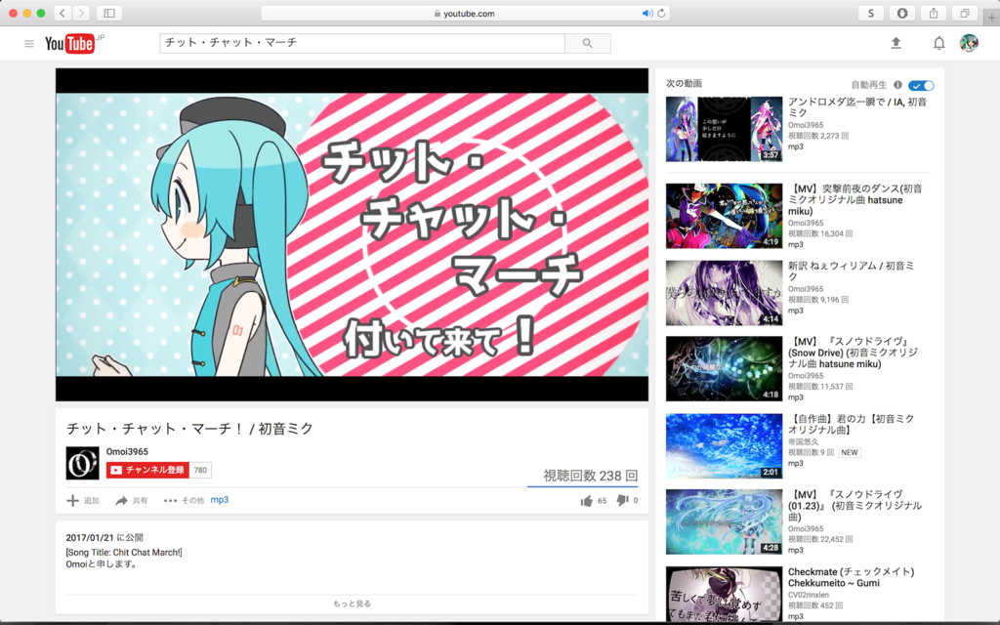

# YouTubeDLSafariExtension

<p align="center">
  
</p>

## Usage

```bash
git clone git@github.com:keisei1092/YouTubeDLSafariExtension.git
```

### Client

* Open Safari
* Enable developer menu
* Open Extension Builder
* Add Extension
* Select this directory
* Install

Installation detail is described [here](http://keisei1092.hatenablog.com/entry/2017/01/22/163934).

### Server

First, install youtube-dl command if you haven't installed

```bash
brew install youtube-dl
```

then

```bash
cd server
bundle install
ruby server.rb
```

(Managing [rodreegez / powder](https://github.com/rodreegez/powder) will be better :+1:)
